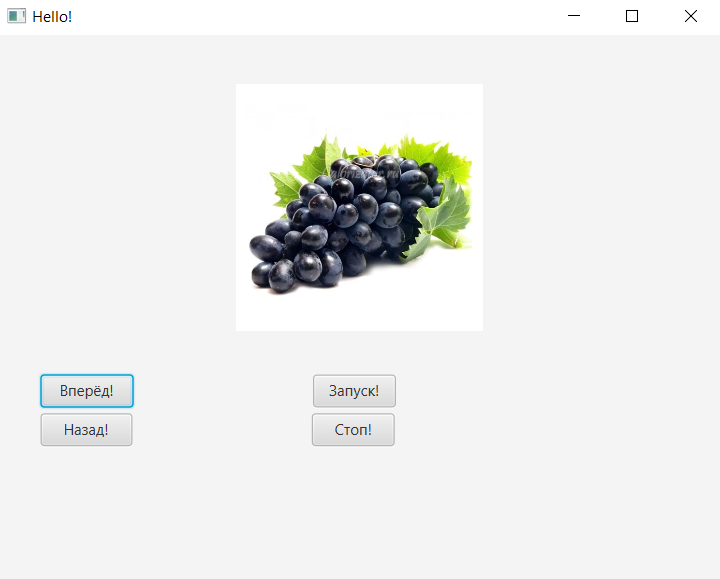

# Итератор
В результате выполнения лабораторной работы был реализован паттерн проектирования "Итератор".
А также реализованы: -Класс, реализующий интерфейс Aggregate, который имеет внутренний класс ImageIterator, реализующий интерфейс Iterator.

# Зависимости
Для работы приложения требуется наличие у пользователя ОС Windows не ниже 7 версии и установленная Java.

# Установка
Для корректной работы программного кода необходимы следующие компоненты:

- Java 11
- JavaFX

# Окно программы

